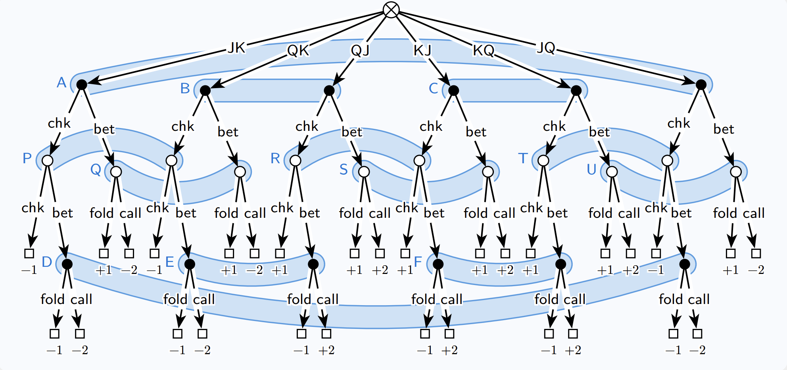

# Counterfactual Regret Minimization Algorithm for Kuhn Poker


This project explores the application of the ***Counterfactual Regret Minimization (CFR)*** algorithm in solving ***imperfect information games***, using ***Kuhn Poker*** as a case study. By modeling Kuhn Poker using an ***extensive form representation***, the CFR algorithm iteratively approximates a mixed ***Nash Equilibrium*** which, as a no-regret strategic profile, can be used to construct an AI that can play Kuhn Poker optimally.

## Kuhn Poker

Kuhn Poker is a simplified two-player poker variant designed to study strategic decision-making
in games with imperfect information. 

Each player is dealt one card from a deck of three cards (J, Q,K). The remaining card is discarded and the winner is determined by the highest card. Players then take turns deciding whether to check, bet, call, or fold based on their private card and the observed actions of their opponent. For simplicity, bets consist of one unit of utility. The game has a zero-sum payoff structure, where one player’s gain equals the other’s loss, and the winner is determined by either a showdown or afold. 


## Extensive form games
Extensive form games provide a framework for modelling sequential games, where players make
decisions in a specific order, and utilities are distributed only at the game’s conclusion. 

These games have a natural tree representation, with each node corresponding to a decision point for
a player or chance and branches representing the available actions. The tree alternates between
players at each level, capturing the sequence of decisions and possible outcomes. Terminal nodes, or
leaves, represent the end of the game, where payoffs are assigned based on the realized action sequence.
The full extensive form representation of Kuhn Poker is shown in the treebelow:



## Imperfect Information
Imperfect information games are games in which players do not have complete knowledge of all
aspects of the game state, such as the private information of other players.


## Mixed Nash Equilibrium

The Nash Equilibrium is a solution concept in game theory that describes a state in which no player can unilaterally (with a single action keeping the other players' strategies constant) deviate from their chosen strategy and improve their outcome.

In a mixed Nash Equilibrium, players randomize their actions, meaning their strategic profiles are probability distributions over the set of pure strategies instead of deterministic choices. This allows for the construction of an AI that can play the game optimally in any given situation.

The following is the computed mixed Nash Equilibrium for Kuhn Poker:

```json
{
    "Player 1": {
        "J": {"BET": 0.20100867105688588, "CHECK": 0.7989913289431141},
        "K": {"BET": 0.5984729442242733, "CHECK": 0.4015270557757267},
        "Q": {"BET": 0.0034583333333333332, "CHECK": 0.9965416666666667},
        "J.CHECK.BET": {"CALL": 0.0003128945095445452, "FOLD": 0.9996871054904555},
        "Q.CHECK.BET": {"CALL": 0.5680283375978771, "FOLD": 0.43197166240212287},
        "K.CHECK.BET": {"CALL": 0.9993773769503104, "FOLD": 0.0006226230496896772}},
    "Player 2": {
        "J.BET": {"FOLD": 0.9995, "CALL": 0.0005},
        "J.CHECK": {"BET": 0.32768883386016545, "CHECK": 0.6723111661398344},
        "Q.BET": {"FOLD": 0.6312096928634149, "CALL": 0.3687903071365851},
        "Q.CHECK": {"BET": 0.0037727272727272726, "CHECK": 0.9962272727272727},
        "K.BET": {"FOLD": 0.0005, "CALL": 0.9995},
        "K.CHECK": {"BET": 0.9995, "CHECK": 0.0005}
    }
}
 ```